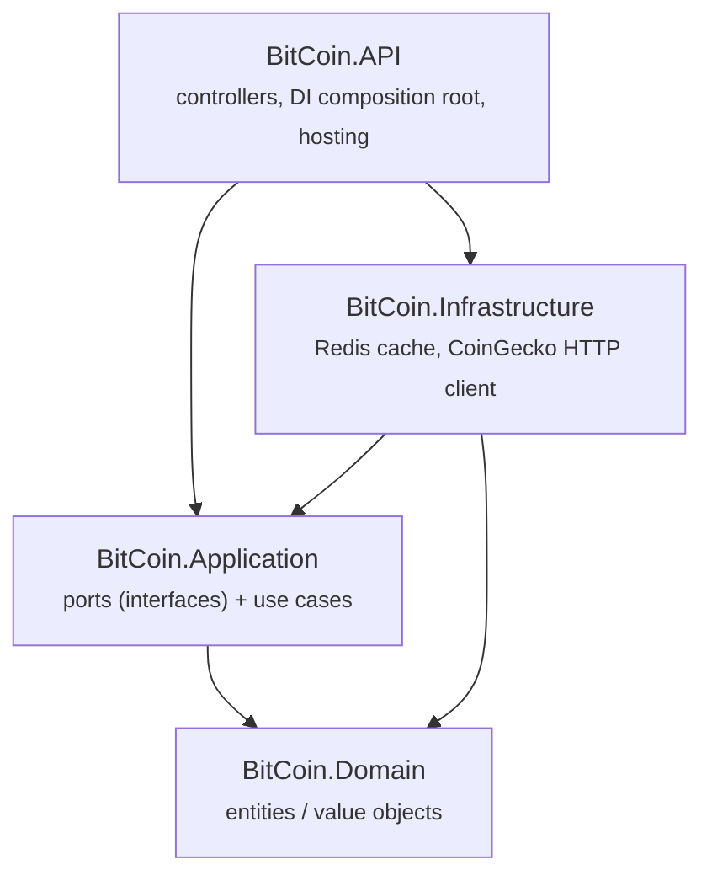

[](https://github.com/rahu619/Bitcoin-API/actions/workflows/ci.yml)

# BitCoin.API

.NET API that returns the latest Bitcoin price.

## Architecture

Onion architecture, dependencies flow inward:



`BitCoin.AppHost` (.NET Aspire orchestrator) and `BitCoin.ServiceDefaults` (shared OpenTelemetry/health-check/resilience
extensions) sit alongside this as standard Aspire template projects, not architectural layers.

## Prerequisites

- [.NET 10 SDK](https://dotnet.microsoft.com/download) (pinned in [global.json](global.json))
- Docker (or another OCI container runtime), for the Aspire-provisioned Redis container

## Usage

Open this repository in a Dev Container (VS Code command: "Dev Containers: Reopen in Container").

Requires Docker (or another container runtime) since the AppHost provisions a Redis container for the
distributed cache.

```cmd
dotnet restore BitCoin.API.slnx
dotnet run --project src/BitCoin.AppHost
``` 

This opens the [Aspire dashboard](https://aka.ms/dotnet/aspire/dashboard) with traces, metrics, and
structured logs for both the API and its Redis cache. See [BitCoin.API.http](src/BitCoin.API/BitCoin.API.http)
for ready-to-run requests to exercise it.

You can still run the API directly when needed, but you'll need a Redis instance reachable via the
`ConnectionStrings:cache` configuration value (e.g. `ConnectionStrings__cache=localhost:6379`):

```cmd
dotnet run --project src/BitCoin.API/BitCoin.API.csproj
```

A background service polls the [CoinGecko](https://www.coingecko.com/en/api) API on an interval
(`ExternalAPISettings:Interval`) and caches the result in Redis; requests are served from cache, not
fetched live per-request.

## Endpoints

| Method | Route                      | Auth | Description                                |
|--------|-----------------------------|------|----------------------------------------------|
| GET    | `/healthz`                 | none | Liveness probe (always on)                  |
| GET    | `/health`                  | none | Aggregate readiness (incl. Redis), Development-only |
| GET    | `/alive`                   | none | Liveness rollup, Development-only            |
| GET    | `/api/v1/bitcoin/latest`   | JWT  | Latest cached Bitcoin price                 |
| GET    | `/api/v1/bitcoin`          | JWT  | Same as above (alternate route)             |

See [BitCoin.API.http](src/BitCoin.API/BitCoin.API.http) for ready-to-run requests, including how to
mint a bearer token for the protected routes.

## Authentication

The `/api/v1/bitcoin*` endpoints require a valid JWT bearer token in the `Authorization` header (the
health endpoints don't, see [Endpoints](#endpoints)).

`Jwt` configuration values are required for token validation:

- `Key`: Symmetric secret used to validate the token signature so tampered/forged tokens are rejected.
- `Issuer`: Ensures the token was issued by the expected authority.
- `Audience`: Ensures the token was created for this API and not another service.

`scripts/generate-dev-jwt.sh` mints a local dev token signed with the placeholder `Jwt:Key` value in
`appsettings.json` (override via `JWT_KEY`/`JWT_ISSUER`/`JWT_AUDIENCE` env vars to match a real configured key).

### Secrets

`appsettings.json`'s `Jwt:Key` is a placeholder (`__USE_ENVIRONMENT_JWT_SECRET_32_CHARS__`), never a real value.

- **Local development**: set the real key with .NET user-secrets, scoped to the `BitCoin.API` project's
  `UserSecretsId`: `dotnet user-secrets set "Jwt:Key" "<value>" --project src/BitCoin.API`.
- **Other environments**: supply it via environment variable (`Jwt__Key`) or a managed secret store
  (e.g. Azure Key Vault). Never commit a real value to `appsettings.json` or `appsettings.*.json`.

## CORS

Allowed origins are configured, not hardcoded, via `Cors:AllowedOrigins` in `appsettings.json` (an array of
origin strings). Override per environment with `Cors__AllowedOrigins__0`, `Cors__AllowedOrigins__1`, etc.

## Testing

```cmd
dotnet test BitCoin.API.slnx
```

CI (see [ci.yml](.github/workflows/ci.yml)) also runs `dotnet format --verify-no-changes` and a NuGet
vulnerable-package scan on every push/PR, so `dotnet format BitCoin.API.slnx` locally before pushing
saves a round trip.

## Status

Side project, written and maintained by a human ([@rahu619](https://github.com/rahu619)) in spare time.
Issues and PRs are welcome but expect an indie pace, not enterprise support.
